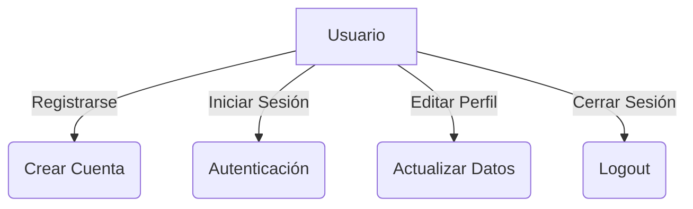
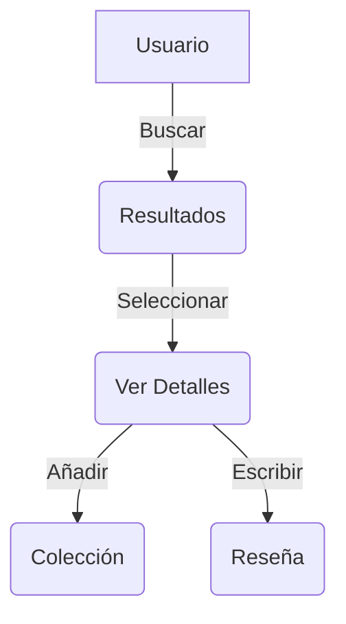
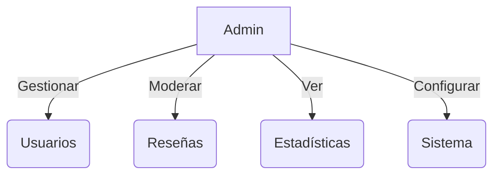

# 2. Análisis y Requisitos

## 2.1. Análisis del Sector

### 2.1.1. Estado del Arte
El sector de aplicaciones web orientadas al cine presenta diversos tipos de soluciones:

1. **Bases de Datos de Películas**
   - IMDB: Referente mundial, enfocado en información exhaustiva
   - TMDB: API abierta, comunidad activa de contribuidores
   - Filmaffinity: Énfasis en reseñas y valoraciones

2. **Redes Sociales de Cine**
   - Letterboxd: Enfoque en diario personal de películas
   - JustWatch: Centrado en disponibilidad en streaming
   
3. **Aplicaciones de Gestión Personal**
   - Diversos gestores de colecciones
   - Apps de seguimiento de visionado

### 2.1.2. Oportunidad Identificada
LaFilmoteca busca unificar las mejores características de estas soluciones:
- Información completa de películas (via TMDB)
- Gestión personal de colecciones
- Componente social moderado
- Enfoque en calidad de contenido

## 2.2. Necesidades del Usuario

### 2.2.1. Perfiles de Usuario

1. **Usuario No Registrado**
   - Búsqueda básica de películas
   - Visualización de información pública
   - Ver reseñas aprobadas

2. **Usuario Registrado**
   - Gestión de perfil personal
   - Creación y gestión de colecciones
   - Publicación de reseñas
   - Interacción con otros usuarios

3. **Administrador**
   - Moderación de contenido
   - Gestión de usuarios
   - Acceso a estadísticas
   - Control total del sistema

## 2.3. Requisitos Funcionales

### 2.3.1. Gestión de Usuarios
- RF1: Registro con email/contraseña
- RF2: Autenticación segura
- RF3: Edición de perfil personal
- RF4: Sistema de roles (usuario/admin)

### 2.3.2. Gestión de Películas
- RF5: Búsqueda por título
- RF6: Visualización de detalles
- RF7: Filtrado por criterios
- RF8: Caché de resultados frecuentes

### 2.3.3. Colecciones
- RF9: Crear/editar colecciones
- RF10: Añadir/quitar películas
- RF11: Configurar privacidad
- RF12: Compartir colecciones

### 2.3.4. Reseñas
- RF13: Crear/editar reseñas
- RF14: Sistema de valoración
- RF15: Moderación de contenido
- RF16: Likes en reseñas

### 2.3.5. Administración
- RF17: Panel de control
- RF18: Gestión de usuarios
- RF19: Moderación de reseñas
- RF20: Estadísticas del sistema

## 2.4. Requisitos No Funcionales

### 2.4.1. Usabilidad
- RNF1: Diseño responsive
- RNF2: Interfaz intuitiva
- RNF3: Tiempos de respuesta < 2s
- RNF4: Feedback claro al usuario

### 2.4.2. Seguridad
- RNF5: Autenticación robusta
- RNF6: Datos sensibles cifrados
- RNF7: Reglas de Firestore estrictas
- RNF8: Tokens JWT seguros

### 2.4.3. Rendimiento
- RNF9: Carga inicial rápida
- RNF10: Optimización de imágenes
- RNF11: Caché eficiente
- RNF12: Paginación adecuada

### 2.4.4. Mantenibilidad
- RNF13: Código documentado
- RNF14: Arquitectura modular
- RNF15: Testing automatizado
- RNF16: CI/CD implementado

## 2.5. Casos de Uso

### 2.5.1. Gestión de Usuario

### 2.5.2. Gestión de Películas

### 2.5.3. Administración

## 2.6. Restricciones Técnicas

1. **Tecnológicas**
   - React 18+
   - TypeScript
   - Firebase
   - Node.js 16+

2. **APIs**
   - Límites de TMDB API
   - Cuotas de Firebase

3. **Seguridad**
   - HTTPS obligatorio
   - Autenticación requerida
   - Validación de datos

4. **Desarrollo**
   - Control de versiones Git
   - Testing obligatorio
   - Documentación actualizada